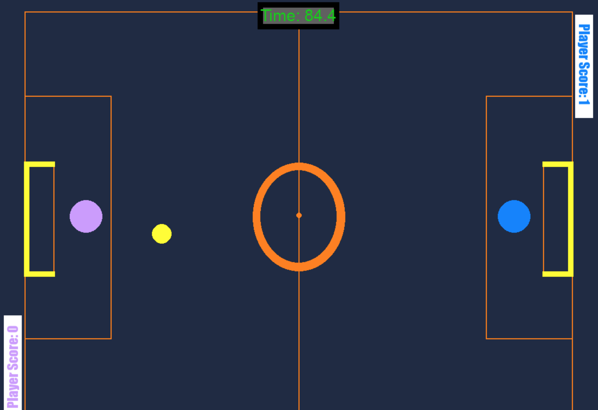

# ⚽ 2D Football Game 🎮



A fun, competitive 2D football (soccer) game built with Pygame featuring two-player local multiplayer action.

## 📌 Table of Contents
- [✨ Features](#-features)
- [🕹️ How to Play](#-how-to-play)
- [📥 Installation](#-installation)
- [🚀 Getting Started](#-getting-started)
- [🎮 Game Mechanics](#-game-mechanics)
- [💻 Code Structure](#-code-structure)
- [📦 Dependencies](#-dependencies)
- [🔧 Future Improvements](#-future-improvements)
- [🛠 Troubleshooting](#-troubleshooting)
- [👏 Credits](#-credits)

## ✨ Features
| Feature | Description |
|---------|-------------|
| **🎯 Two-Player Mode** | Local multiplayer with keyboard controls |
| **⚡ Physics Engine** | Realistic ball movement and collisions |
| **📊 Live Scoring** | Track goals for both players |
| ⏱️ **Game Timer** | 2-minute matches with countdown |
| 🖌️ **Visual Feedback** | Color changes when scoring/time running low |
| 🔄 **Auto Reset** | Players and ball reset after goals |

## 🕹️ How to Play

### 👥 Player Controls
| Player | Color | Controls |
|--------|-------|----------|
| Player 1 (Left) | 🔵 Blue | Arrow Keys (↑, ↓, ←, →) |
| Player 2 (Right) | 🟣 Purple | WASD Keys |

### 🎯 Game Objective
- Score by hitting the ball into your opponent's goal
- The player with most goals after 2 minutes wins
- Avoid letting the ball enter your own goal!

### 📜 Game Rules
1. Players cannot enter the goal areas
2. Ball resets to center after each goal
3. Game automatically ends after 2 minutes

## 📥 Installation

### Prerequisites
- Python 3.6+
- Pygame library

### Installation Steps
1. Clone the repository:
   ```bash
   git clone https://github.com/yourusername/2d-football-game.git
   cd 2d-football-game

```markdown
# 🏆 2D Football Game - Complete Code Documentation

## 🏗️ Core Architecture
```python
# Main Components:
1. Circle()    - Player paddles with movement logic
2. Ball()      - Game ball with physics/collisions  
3. Score()     - Scoring system and display
4. Field()     - Football field rendering
5. Keys()      - Keyboard input handling
6. Timer()     - Game countdown system
7. Game()      - Main game loop manager
```

## 🔍 Detailed Code Explanation

### 1. 🎮 Game Initialization
```python
# Pygame Essentials
pygame.init()                            # Initialize engine
screen = pygame.display.set_mode((1100, 800))  # Game window
clock = pygame.time.Clock()              # FPS controller
running = True                           # Game state flag

# Game Timing  
start_time = datetime.now()              # Match start timestamp  
game_duration = 120                      # 2-minute game
```

### 2. ⭕ Circle Class (Players)
```python
class Circle:
    def __init__(self, x, y, color):
        self.radius = 30      # Paddle size
        self.speed = 5        # Movement speed
        self.color = color    # Player color (blue/purple)
        
    def move(self, dx, dy):
        # Prevent goal zone entry
        if not self.is_blocking(new_x, new_y):
            self.x += dx * self.speed
            self.y += dy * self.speed
            
    def is_blocking(self, x, y):
        # Check collision with goal areas
        return (left_goal.collidepoint(x,y) or 
                right_goal.collidepoint(x,y))
```

### 3. ⚽ Ball Class
```python
class Ball:
    def __init__(self):
        self.target = random.choice([player1, player2])  # Initial AI target
        self.speed = 5                 # Base movement speed
        self.just_scored = False       # Goal cooldown flag
        
    def move(self):
        # Vector-based movement
        if self.target:
            dx, dy = normalize_vector(target.x - self.x, target.y - self.y)
            self.x += dx * self.speed
            self.y += dy * self.speed
            
    def collide(self, paddle):
        # Elastic collision response
        if distance(paddle) < self.radius + paddle.radius:
            self.speed *= 1.2          # Speed boost on hit
            self.target = None         # Enter free movement
            angle = calculate_angle(paddle)  # Ricochet physics
            self.bounce(angle)
```

### 4. 📊 Score Class
```python
class Score:
    def update(self):
        # Goal detection
        if ball_in_left_goal:
            self.player2_score += 1
        elif ball_in_right_goal:
            self.player1_score += 1
            
    def draw(self):
        # Vertical score displays
        pygame.draw.rect(screen, WHITE, (9, 581, 33, 190))  # P1
        pygame.draw.rect(screen, WHITE, (1058, 28, 33, 190)) # P2
        screen.blit(rotate_text(score1), (10,600))
        screen.blit(rotate_text(score2), (1060,45))
```

### 5. 🎛️ Input Handling
```python
class Keys:
    def process_input(self):
        keys = pygame.key.get_pressed()
        
        # Player 1 (Arrow keys)
        if keys[K_UP] and player1.y > min_y:
            player1.move(0, -1)
            
        # Player 2 (WASD)
        if keys[K_w] and player2.y > min_y:
            player2.move(0, -1)
        
        # ESC to quit
        if keys[K_ESCAPE]:
            global running
            running = False
```

### 6. ⏱️ Game Timer
```python
class Timer:
    def update(self):
        elapsed = (datetime.now() - start_time).seconds
        remaining = max(0, game_duration - elapsed)
        
        # Color-coded display
        color = RED if remaining < 10 else GREEN
        draw_text(f"Time: {remaining}s", color)
        
        # End game condition
        if remaining <= 0:
            end_game()
```

### 7. 🔄 Main Game Loop
```python
class Game:
    def run(self):
        while running:
            # 1. Process Input
            Keys().process_input()
            
            # 2. Update Game State
            ball.move()
            ball.collide(player1)
            score.update()
            timer.update()
            
            # 3. Render Frame
            Field().draw()
            player1.draw()
            ball.draw()
            score.draw()
            
            # 4. Maintain 70 FPS
            pygame.display.flip()
            clock.tick(70)
```

## 🧮 Key Physics Formulas

### Ball Movement Vector
```python
def normalize_vector(dx, dy):
    distance = (dx**2 + dy**2)**0.5
    return dx/distance, dy/distance
```

### Collision Angle Calculation
```python
def calculate_angle(paddle):
    return math.atan2(ball.y - paddle.y, 
                      ball.x - paddle.x)
```

### Speed Adjustment
```python
# After collision:
new_speed = old_speed * 1.2  # 20% speed increase
```

## 🛠️ Development Notes

### Class Relationships
```mermaid
graph TD
    Game --> Timer
    Game --> Keys
    Game --> Field
    Game --> Score
    Score --> Ball
    Keys --> Circle
    Ball --> Circle
```

### Performance Considerations
- Locked at 70 FPS for smooth gameplay
- All collisions use distance checks (no pixel-perfect)
- Minimal object creation during runtime

### Extension Points
1. Add `Powerup` class for special abilities
2. Implement `AI` class for single-player
3. Expand `Field` with dynamic obstacles

## License
This project is licensed under the MIT License - see the [LICENSE](LICENSE) file for details.
